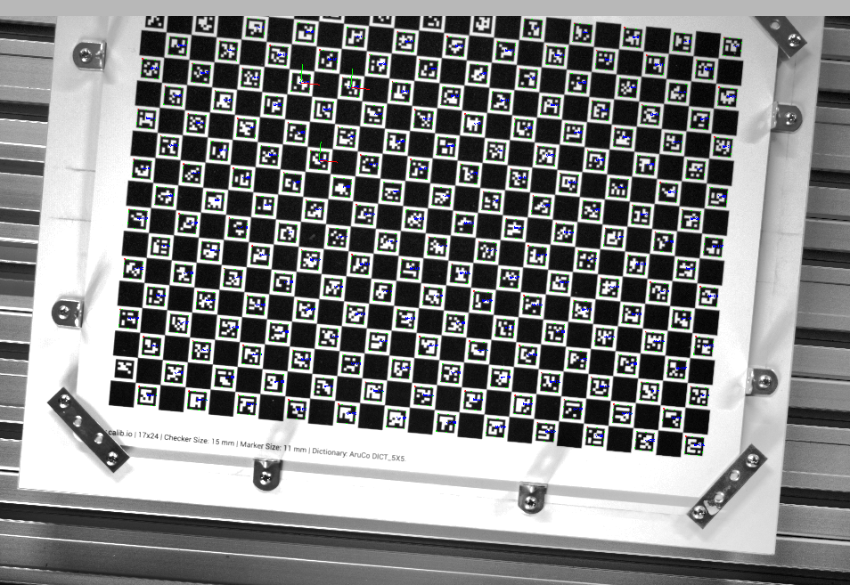

# ROS 2 ArUco Detector Skill



A highly configurable ROS 2 node for detecting ArUco markers and estimating their 6D poses in the camera frame using **OpenCV 4.12**. 

## Features
* **OpenCV 4.12 Integration:** Utilizes the latest `cv::aruco` module features and robust pose estimation solvers.
* **Pre-processing:** Optional CLAHE (Contrast Limited Adaptive Histogram Equalization) and Adaptive Thresholding to handle challenging lighting conditions.
* **TF2 Broadcasting:** Automatically publishes static or dynamic transforms from the camera frame to the detected markers.
* **Action Server:** Control detection states dynamically via ROS 2 Actions.
* **Highly Configurable:** Exposes exhaustive ArUco detection parameters and dictionary settings via standard ROS 2 `.yaml` configuration files.

## Dependencies
* ROS 2 (Tested on Jazzy Jalisco)
* OpenCV 4.12.0
* `cv_bridge`
* `tf2_ros`
* `image_transport`

## Configuration (`config.yaml`)

The behavior of the node is entirely controlled by its parameter file. 

```yaml
# Configuration file
aruco_detector_skill_server:
  ros__parameters:
    RosVerbosityLevel: "DEBUG"
    LogFolderPath: ""
    DebugTools: true

    # ── Camera Topics ──────────────────────────────────────────────────────────
    Camera:
      imageSubTopic: "/camera_static/image_raw"
      cameraInfoTopic: "/camera_static/camera_info"

    # ── Result Publisher ───────────────────────────────────────────────────────
    Result:
      topic: "result"
      showRejected: false

    # ── PnP / TF ───────────────────────────────────────────────────────────────
    PnPMethod: 7 # 7 = cv::SOLVEPNP_IPPE_SQUARE (Optimal for 4-point markers)
    UseStaticTfBroadcaster: true

    # ── CLAHE ──────────────────────────────────────────────────────────────────
    Clahe:
      use: true
      clipLimit: 4.0
      sizeX: 2
      sizeY: 2

    # ── Adaptive Threshold ─────────────────────────────────────────────────────
    AdaptiveThreshold:
      use: false
      maxValue: 255.0
      method: 4          # cv::ADAPTIVE_THRESH_GAUSSIAN_C
      type: 0            # cv::THRESH_BINARY
      blockSize: 45
      constantOffsetFromMean: 0.0

    # ── Dictionary ─────────────────────────────────────────────────────────────
    Dictionary: "DICT_5X5_1000"

    # ── ArUco Detector Parameters ──────────────────────────────────────────────
    Aruco:
      markerLength: 0.011 # Measured in meters (11mm)
      markerIds: [75, 40, 39] # Targets specific IDs

      # Adaptive thresholding
      adaptiveThreshWinSizeMin: 3
      adaptiveThreshWinSizeMax: 23
      adaptiveThreshWinSizeStep: 10
      adaptiveThreshConstant: 7.0

      # Contour filtering
      minMarkerPerimeterRate: 0.03
      maxMarkerPerimeterRate: 4.0
      polygonalApproxAccuracyRate: 0.03
      minCornerDistanceRate: 0.05
      minDistanceToBorder: 3
      minMarkerDistanceRate: 0.05

      # Corner refinement (0=NONE, 1=SUBPIX, 2=CONTOUR, 3=APRILTAG)
      cornerRefinementMethod: 0
      cornerRefinementWinSize: 5
      cornerRefinementMaxIterations: 30
      cornerRefinementMinAccuracy: 0.1
      relativeCornerRefinmentWinSize: 0.3  # note: OpenCV typo preserved

      # Marker decoding
      markerBorderBits: 1
      perspectiveRemovePixelPerCell: 4
      perspectiveRemoveIgnoredMarginPerCell: 0.13
      maxErroneousBitsInBorderRate: 0.35
      minOtsuStdDev: 5.0
      errorCorrectionRate: 0.6

      # AprilTag (only used when cornerRefinementMethod: 3)
      aprilTagQuadDecimate: 0.0
      aprilTagQuadSigma: 0.0
      aprilTagMinClusterPixels: 5
      aprilTagMaxNmaxima: 10
      aprilTagCriticalRad: 0.1745  # 10 * PI / 180
      aprilTagMaxLineFitMse: 10.0
      aprilTagMinWhiteBlackDiff: 5
      aprilTagDeglitch: 0

      # Misc
      detectInvertedMarker: false
      useAruco3Detection: false
```

### Key Parameters Explained

* **`PnPMethod: 7`**: Uses `cv::SOLVEPNP_IPPE_SQUARE`. This algorithm is strictly designed for planar rectangular markers and perfectly avoids the minimum 6-point requirement crashes of DLT.
* **`Aruco.markerLength: 0.011`**: Defines the physical size of the printed markers (11mm). By providing this in meters, the resulting TF frames will correctly represent translation in standard ROS metrics.
* **`Aruco.markerIds`**: Allows the node to actively search for and filter only the IDs specified (e.g., `75, 40, 39`).

## Usage

### 1. Launch the Server
Launch the node and pass the YAML parameter file:

```bash
ros2 launch aruco_detector_skill_server run.launch.py
```

### 2. Trigger via Action Server
You can control the detection node by sending an action goal. To trigger the operation, send a goal with `operation: 0`.

```bash
ros2 action send_goal /ArucoDetectorSkill aruco_detector_skill_msgs/action/ArucoDetectorSkill operation:\ 0\
```

### 3. View Results
To view the visual detection results, open `rviz2` and subscribe to the `result` topic:
